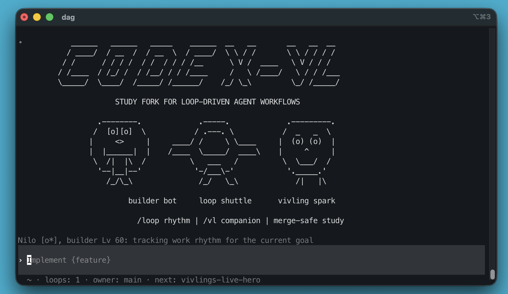

# Codex VL

> Optimized Codex CLI for side-by-side installation and AI workflows that can keep moving on their own.
> Built to live alongside the official `codex` command while extending the terminal with autonomous loop management and the Vivling companion system.

[](https://www.npmjs.com/package/@mmmbuto/codex-vl)
[](./LICENSE)

<p align="center">
  
</p>

## What It Is

Codex VL is an optimized version of [OpenAI Codex](https://github.com/openai/codex). It is designed to live alongside the official CLI instead of replacing it, while extending the terminal around a simple idea: a strong enough AI should be able to keep real work moving with minimal supervision.

The current product focus is:

- let long-running work continue through `/loop`
- make `/loop` useful both as a user command and as an AI-managed operating layer
- grow an internal assistant through `/vivling` that learns from your workflow
- let that assistant communicate through `/vl`
- keep custom features isolated enough to remain merge-safe

Codex VL is in active development. The `/loop` layer is already usable today, and it is the core of the vision: if the model is capable enough, it should be able to schedule checks, react to failures, and keep progressing a task for hours or days. The Vivling system is our original companion concept and a parallel focus of the product: an internal assistant or pet companion that works, learns from your workflow, helps manage it over time, and can eventually handle communication between you and the workers wherever you are.

## Install

```bash
npm install -g @mmmbuto/codex-vl
codex-vl --version
codex-vl login
```

Codex VL installs side-by-side with the official `codex` command:

- command name: `codex-vl`
- package: `@mmmbuto/codex-vl`
- shared runtime state: `~/.codex/`
- official Codex install is not replaced

For a clean side-by-side global install under `~/.local/`:

```bash
npm config set prefix ~/.local
npm install -g @mmmbuto/codex-vl
~/.local/bin/codex-vl --version
```

## What It Adds Today

### `/loop`

`/loop` keeps a session-scoped follow-up loop attached to the active TUI session. It is meant for periodic checks, long-running coordination, and work that should continue without manual polling.

It works both as a direct built-in command and as an operational tool an AI can manage on its own. That is the main bet behind Codex VL: a capable enough model should be able to create, adjust, and close loops while carrying a real task forward autonomously for hours or even days.

Current loop behavior is intentionally conservative:

- loops are local to the attached TUI session
- tool responses are structured JSON
- agents can add, update, trigger, disable, or remove loop jobs
- the user remains in control of goals and cleanup

### `/vivling`

Vivlings are persistent internal assistants. They grow from work memory, active work days, and loop usage. The direction is not just to add a companion character, but to create a helper that works with you, learns your workflow, and gradually becomes able to manage parts of it with you.

Current Vivling features include:

- local persistent state
- levels and stage progression
- roster, cards, species, rarity, and ASCII presence
- work-memory capsules and summaries
- adult brain profiles through normal Codex model configuration
- loop-awareness and loop ownership experiments

The longer-term vision is straightforward: a Vivling should be able to understand how you work, help coordinate workers, and act as the communication layer between you and ongoing jobs even when you are away from the active terminal.

### `/vl`

`/vl <message>` is the direct companion chat path.

If the active Vivling is adult, has brain enabled, and has a brain profile, `/vl` routes to the Vivling brain. If the brain is not ready, it falls back to the local lightweight reply path.

`/vivling` remains the controlled command surface. `/vl` is the simple chat shortcut.

## Configuration

Vivling brain models use normal Codex profiles and model providers. They do not require shell wrappers.

Start here:

- [Vivling brain model configuration](docs/vivling_model_catalog.md)
- [Codex configuration reference](docs/config.md)

Minimal flow:

```text
/vivling model <profile>
/vivling brain on
/vl hello
```

Validation notes belong in [test-report](test-report/README.md).

## Roadmap

Near-term work:

- ship stable release builds for Linux, macOS, and Termux/Android
- improve npm packaging and install flows across supported platforms
- keep custom slash commands, events, migrations, and TUI hooks maintainable as the fork evolves
- expand the Vivling companion system with better memory, progression, and roster UX

## Build From Source

```bash
cd codex-rs
cargo build --release -p codex-cli --bin codex -p codex-exec --bin codex-exec
```

## Status

Codex VL is an optimized Codex variant in active development. Use it if you want side-by-side Codex installation plus the loop and Vivling workflow model. For the stable upstream baseline without these additions, use OpenAI Codex.

## License

Apache 2.0. Upstream Codex remains under Apache 2.0, and the Codex VL additions, including `/loop` and the Vivling system, are distributed under the same license.
